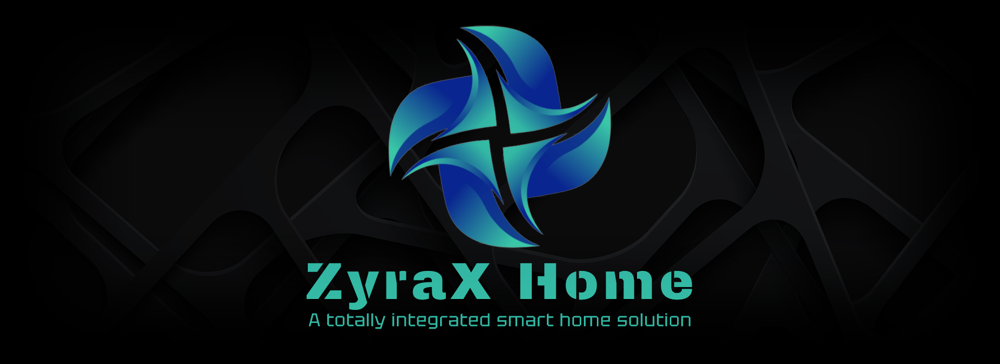

# ZyraX Home | Main controller

[ZyraX Home](https://zyraxhome.munkservices.com/) is an open-source platform (in early-stage of development) engineered as a unified smart home system. It provides centralized control and real-time monitoring of energy consumption, integrates sensor data, and manages lighting. The platform supports extensible modules and automation rules, enabling fine-grained control over your whole home.

See `documentation/images` for more product images.

> Note: For those who prefer not to program it themselves, plug-and-play solutions are also available for purchase on [ZyraX Home](https://zyraxhome.munkservices.com/plug-play-products).

### Features

ZyraX Home is in early-stage of development, with continuous improvements planned. See section `8.2 Roadmap` for a complete overview of upcoming features and components. Key features in version `0.9.0 Beta` include:

- **Easy device onboarding and configuration**
    - Automatic WiFi device scans
    - Real-time RF signal listening for RF code mapping

- **Multiple user profiles to suit the needs and preferences**
    - Use one account with multiple profiles

- **Customizable dashboards:**
    - Device and group widgets with detailed status and controls
    - Date/time and weather forecast widgets, more coming soon

- **Device grouping:**
    - Synchronize devices or assign groups as automation targets

- **RF sensor support. Tested models:**
    - Contact sensors:
        - [433MHz Two-way Intelligent Door/Window Sensor](https://nl.aliexpress.com/item/4000780196360.html)
    - PIR motion sensors
        - [Sonoff PIR RF Motion Sensor](https://nl.aliexpress.com/item/1005008632282924.html)
        - [TAIBOAN 433MHz PIR Motion Sensor](https://nl.aliexpress.com/item/1005005510159304.html)

- **RF switch support. Tested models:**
    - [433Mhz Wall Panel Touch Switch](https://nl.aliexpress.com/item/1005002572663479.html)

- **RF remote support. Tested models:**
    - [433Mhz 4 Keys Remote Control](https://nl.aliexpress.com/item/1005006725173688.html)

- **Automation engine:**
    - **Triggers:** scheduled events, sensor input, switch input
    - **Targets:** individual devices, device groups

- **Alarm:**
    - Alarm can be triggered by sensors and can send real-time messages via Telegram

- **Fully feature suite for addressable (ZyraX Home) RGBW LED strips:**
    - Easy LED addressing configuration through the GUI
    - Real-time LED coloring
    - More than 16 fully customizable animations
    - 4 power animations
    - 10 color palettes
    
- **Over-The-Air LED strip updates:**
    - LED strip firmware can be updated remotely

### About the ZyraX Home platform

The ZyraX Home platform is designed for **modularity and extensibility**, allowing developers to integrate custom devices, extend automation logic, and interface with external APIs.

The vision of the ZyraX Home platform is to provide a high-end, fully integrated smart home experience. Every component, from lighting and sensors to automations and third-party devices/services, will work seamlessly together under a single platform, creating a unified, intelligent home environment. The system aims to combine luxury, flexibility, and advanced functionality, making it easy for users to manage and expand their smart home setup while ensuring reliability and performance.

This main ZyraX Home controller serves as the central interface and management hub for all connected components. It supports integration of modules such as RF sensors, automations and LED strips, with additional modules currently in development.  

The controller software is cross-platform and can run on Windows and Linux systems, though a Raspberry Pi is recommended for deployment. This repository includes software and documentation for the main controller.

### Other ZyraX Home devices

The platform can integrate with other open-source components developed for the ZyraX Home ecosystem:

- [ZyraX Home | RGBW LED strip controller](https://github.com/LukedeMunk/zyrax-home-rgbw-led-strip-controller/releases)
- [ZyraX Home | RF & Zigbee bridge](https://github.com/LukedeMunk/zyrax-home-rf-zigbee-bridge/releases) (Unreleased, in development)
- [ZyraX Home | IP camera](https://github.com/LukedeMunk/zyrax-home-ip-camera/releases) (Unreleased, in development)
- [ZyraX Home | ElectriControl]() (Unreleased, in development)
- [ZyraX Home | iOS app](https://github.com/LukedeMunk/zyrax-home-ios-app/releases) (Unreleased, in development)

## 1. Bill of Materials

The bill of materials is presented below.

- 1x [Raspberry Pi 3b+ or newer](https://www.raspberrypi.com/)
- 1x [2A 5V adapter](https://www.raspberrypi.com/products/power-supply/)
- 1x [32 GB Micro SD](https://shop.sandisk.com/nl-nl/products/memory-cards/microsd-cards/sandisk-ultra-uhs-i-microsd?sku=SDSQUA4-032G-GN6MA)
- (optional) 1x [433 Mhz RF reciever (RX470-4)](https://nl.aliexpress.com/item/1005003436580019.html) & 3x [Jumper wires](https://nl.aliexpress.com/item/4000667468358.html)
- (optional) [433MHz Two-way Intelligent Door/Window Sensor](https://nl.aliexpress.com/item/4000780196360.html)
- (optional) [Sonoff PIR RF Motion Sensor](https://nl.aliexpress.com/item/1005008632282924.html)
- (optional) [TAIBOAN 433MHz PIR Motion Sensor](https://nl.aliexpress.com/item/1005005510159304.html)
- (optional) Other 433MHz RF sensors
- (optional) Other ZyraX Home devices

## 2. Compatible firmware of other ZyraX Home devices

The table below lists the compatible firmware versions for each version of the main controller.

| **Version**     | **Device**     | **Compatible firmware versions**                       |
|-------------    |----------------------    |------------------------------------    |
| v0.9.0 Beta     | RGBW LED strip controller    | [v0.9.0 Beta](https://github.com/LukedeMunk/zyrax-home-rgbw-led-strip-controller/releases)     |

## 3. Getting Started (Raspberry Pi 4 - Raspbian OS)

These instructions provide an overview for setting up and running the ZyraX Home main controller application.

> Note: While the application is compatible with Windows, a Linux environment is recommended for optimal performance.

### 3.1 Connect RF receiver to Raspberry Pi OS (optional)

Use the schematic to connect the RF receiver to the Raspberry Pi, to be able to connect RF sensors to the system.

### 3.2 Make Raspberry Pi OS ready

1. Flash the [Raspi OS Lite (64-bit)](https://www.raspberrypi.com/software/) image on the SD card (with the imager):
    - Configure OS:
        * Hostname: `mastercontroller`
        * Username: `zyraxhome`
        * Password: Use a strong password (At least one upper case character, one lowercase character, one number and one symbol. At least 8 characters long.)
        * Using Wifi:
            * SSID: Network with internet
            * Password: Password of that network (To connect to a hidden WiFi network after flashing, use `sudo raspi-config nonint do_wifi_ssid_passphrase "SSID" "PASSWORD" 1`)
        * Enable SSH.
2. Boot Raspberry Pi and [connect with ssh](https://www.putty.org/).
    - Use `mastercontroller.local`
    - Or to find IP:
        * Connect to a monitor with HDMI, login and then: `ifconfig`
        * Install [Advanced IP scanner](https://www.advanced-ip-scanner.com/en/) and do a network scan. Make sure to use the right IP range.

### 3.3 Install application

1. Download the latest [release](https://github.com/LukedeMunk/zyrax-home-main-controller/releases).
2. Run `install.sh`:
    - `sh install.sh`
    - Unexpected end of file error? -> `sudo dos2unix install.sh`
3. Navigate to [mastercontroller.local](mastercontroller.local)
4. (Optional) To configure the weather API, check [Visual Crossing website](https://github.com/LukedeMunk/zyrax-home-main-controller/releases).
5. (Optional) To configure the Telegram alarm messages, check the [Telegram](https://core.telegram.org/bots/api) documentation.

> Note: When visiting [mastercontroller.local](mastercontroller.local), a browser security notification will appear because local SSL keys are being used. This warning can be safely ignored.

> Note: Running into problems? Go to **8. Throubleshooting**.

## 4. Configure RF sensors (optional)

A few RF sensors have been tested, but any 433 MHz sensor should work. On the configuration page, you can select the model that matches your sensor, map its RF codes, and use the sensor for automations or with the alarm.

> Note: Visit [ZyraX Home | Documentation](https://zyraxhome.munkservices.com/documentation/) for more in depth instructions including screenshots.

## 5. Configure RF switches (optional)

A few RF switches have been tested, but any 433 MHz switch should work. On the configuration page, you can select the model that matches your switch, map its RF code, and use the switch for automations.

> Note: Visit [ZyraX Home | Documentation](https://zyraxhome.munkservices.com/documentation/) for more in depth instructions including screenshots.

## 6. Configure ledstrips (optional)

To add new [RGBW LED strip controllers](https://github.com/LukedeMunk/zyrax-home-rgbw-led-strip-controller/releases) to the system, please boot the LED controller (with a compatible firmware version) and connect it to the same network as the main controller.

At the configuration page -> Add device -> Choose device or choose `My accessory is not shown here` -> Configure options -> Configure LED addressing

> Note: Visit [ZyraX Home | Documentation](https://zyraxhome.munkservices.com/documentation/) for more in depth instructions including screenshots.

## 7. Documentation

Several documentation files describe this project and system. The list of these files is provided below.

- [Circuit diagram](documentation/hardware/schematic_v0_1.png)
- [Entity Relation Diagram](documentation/software/ERD_v0_9_0_Beta.png)
- [Full platform overview](documentation/software/overview_v0.1.png)
- [ZyraX Home | Documentation](https://zyraxhome.munkservices.com/documentation)

## 8. Troubleshooting

### 8.1 Known bugs

| **Bug**    | **Version**    | **Planned Fix Version**     |
|------------|----------------|-----------------------------|
| Server becomes unavailable (HTTP code `502`) for a minute after enabling RF receiver | v0.9.0 | v1.0.0 |
| RF remote control loads only 1 code | v0.9.0 | v1.0.0 |
| LED strip IP not displayed at configuration screen | v0.9.0 | v1.0.0 |
| LED strip model ID not saved during update | v0.9.0 | v1.0.0 |

### 8.2 Errors

- When the interface does not load in the browser, the Nginx server is not running correctly:
    - Use `sudo systemctl status nginx` for the service status. The service needs to be running and enabled

- When the interface returns an HTTP `502` error, it indicates that the Nginx server is running, but the Flask application is currently unavailable:
    - Use `sudo systemctl status zyrax_home` for the service status. The service needs to be running and enabled
    - Use `sudo journalctl -u zyrax_home -f` for the log list. Usually an error is displayed

## 9. Remarks

### 9.1 Risk assessment

This security risk assessment evaluates potential threats and vulnerabilities related to the Zyrax Home application. The goal is to identify key risks, assess their impact and likelihood, and provide guidance on appropriate mitigation measures. This ensures the application remains secure and reliable for its users.

| **Threat**    | **Effect**    | **Vulnerability**     | **Probability**   | **Impact**    | **Mitigation**   |
|-------------  |----------------------    |----------------------    |------------------------------------    |------------------------------------    |------------------------------------    |
| Unauthorized SSH server access     | Exposure of credentials, unauthorized access to devices | Weak SSH credentials    | Rare    | Critical    | Use of strong SSH credentials     |
| Data exfiltration     | Exposure of credentials and data | Weak encryption    | Rare    | Moderate | Use of strong encryption and hash algorithms     |
| MITM attacks     | Exposure of credentials and data | Use of HTTP    | Unlikely    | Moderate | Use of HTTPS     |

### 9.2 Roadmap

Below is a roadmap for the ZyraX Home main controller, highlighting the key versions. Minor updates are not included, as listing every change would be impractical. This roadmap is intended as a brainstorming outline, and all features are subject to change. Any suggestions? Please contact Luke de Munk.

| **Version**   | **Expected release**  | **Key features**                      |
|-------------  |---------------------- |------------------------------------   |
| v0.9.0 Beta   | 11-2025               | First public test release                                                 |
| v1.0.0        | 01-2026               | Improved security                                                         |
|               |                       | Improved LED strip addressing configuration UI                            |
|               |                       | Improved LED strip addressing, real-time LED feedback                     |
|               |                       | Real-time LED feedback. Capable of showing real-time LED states in the UI |
|               |                       | Automatic software update notification and improved software update routine |
|               |                       | Improved OTA LED strip update functionality                               |
|               |                       | Improved alarm functionality & security                                   |
|               |                       | Device location and location based automation targets                     |
|               |                       | Tap-to-run dashboard shortcut and automation, multiple actions            |
|               |                       | Scenarios: create color scenarios for LED strip groups                    |
|               |                       | Sender verification (by hash) for HTTPS commands                          |
|               |                       | Real-time LED strips synchronization                                      |
|               |                       | Configurable number of buttons for RF remotes                             |
| v1.1.0        | 2026                  | Alarm functionality & security improvements                               |
|               |                       | RF power outlet support                                                   |
|               |                       | [RF & Zigbee bridge]() support                                            |
|               |                       | [Athom GU10 bulb](https://www.athom.tech/blank-1/wled-gu10-rgbcw) support |
|               |                       | [iOS app]() integration                                                   |
|               |                       | Alarm notifications over MQTT (only with iOS app)                         |
|               |                       | Auto arm/disarm alarm by geofencing (only with iOS app)                   |
|               |                       | Automatic bluetooth LED strip configuration                               |
| v1.2.0        | 2026                  | Data insights (sensor data, actuator data)                                |
|               |                       | Advanced automation programming. No-code block based programming          |
|               |                       | Added modes to LED strip scenarios                                        |
| v1.3.0        | 2026                  | [IP camera]() support                                                     |
|               |                       | Custom LED strip mode creation                                            |
| v1.4.0        | 2026                  | Smart scenarios based on machine learning                                 |
| v1.5.0        | 2026                  | AI chatbot for controlling the system                                     |
| v1.6.0        | 2026                  | AI voice control integration                                              |
| v1.7.0        | 2027                  | [ElectriControl]() support                                                |
|               |                       | Improved data insights                                                    |
|               |                       | Added data insights for energy consumption                                |
| v1.8.0        | 2027                  | Smart energy saving schemes based on machine learning                     |

## 10. Issues, recommendations, feedback & security reports

I truly appreciate the opportunity to resolve issues and receive feedback on my work. This is a one-person hobby project into which I've invested many hours. If you have any recommendations, tips, or feedback, please feel free to open an issue or contact me directly.

## 11. Contributing

When contributing to this repository, please read [CONTRIBUTING.md](CONTRIBUTING.md), [HTML/CSS/JavaScript conventions](documentation/software/HTML_CSS_JAVASCRIPT_CONVENTIONS.md) and [Python conventions](documentation/software/PYTHON_CONVENTIONS.md).

## 12. Authors

* **Luke de Munk** - Project maintainer - [Munk IT](munkservices.com) | [LinkedIn](https://www.linkedin.com/in/luke-de-munk/)